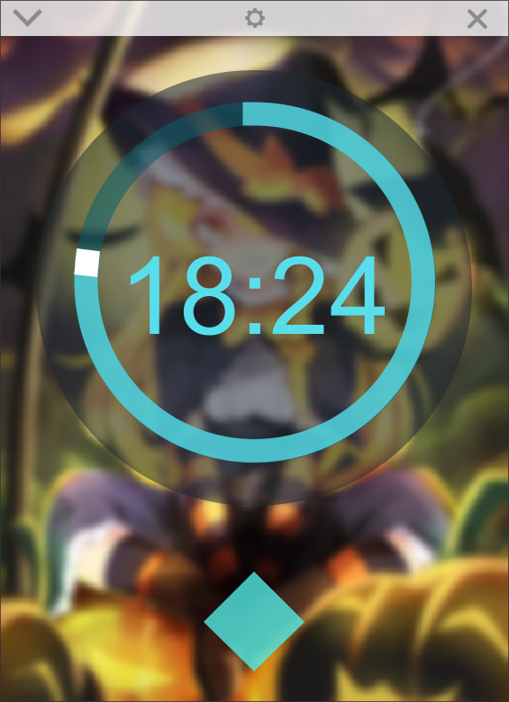
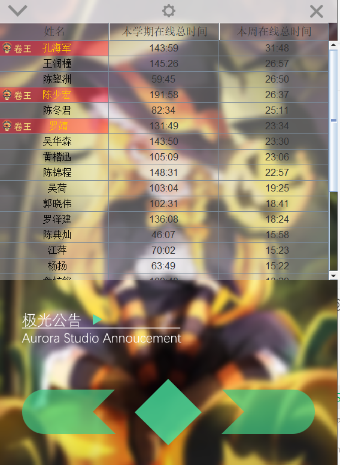

# AuroraTimer

The timer of AuroraStudio

- 搭配服务端 https://github.com/ZolHo/AuroraTimerServer 使用

> 由于当年没有留下软件截图，我在22年2月22日问工作室师弟要截图的时候发现，他们在没问过我的情况下，已经对我的计时器进行了改版~~说明我的代码注释好、结构清晰吧~~，框架重构，客户端换了我的壁纸，以及加了卷王图标.. *但我觉得我当时的壁纸会比这个好看*。最重要的是，他们改我项目居然没fork加star，我哭死
- [他们的改版链接] https://github.com/SGU-AuroraStudio/AuroraTimerServerSSM
- 师弟改版客户端截图  

项目是在大二寒假，收到师兄的任务后（完成一个可以记录工作室成员每周呆在工作室时长的软件），在寒假自学Java、Web技术、桌面端开发，并设计计时算法、数据库完成，主要功能和设计思路如下：
- 使用心跳的方式每隔一段时间发送心跳包计时，服务器存储上次心跳时间，如果距离上次心跳间隔小于m分钟，则判定这m分钟在线，将数据累积进数据库。若间隔大于k分钟，则更新心跳时间但不计时。
- 前后端分离，用HTTP协议交换Json格式数据，清晰明了
- 客户端和服务器都基于MVC的思想，分离了视图和功能，可能也方便了师弟们重构
- 我尝试实现了对运行程序进行自动更新，当服务器有新版本的时候，会通过下载一个update helper进行辅助更新
- 自定义配置背景图，还考虑过通过反射为它配置自定义插件，但是额，没做了。

总结：虽然这个项目比较简单，但是也是我第一个项目，并且是根据需求，从UI设计到最后的部署全部独立完成，并且至今(22年)也使用了5年以上，别的不说，很实用。也算是对工作室做出的小贡献。可惜的是没有署名，重构了都没有小师弟小师妹来找我！
